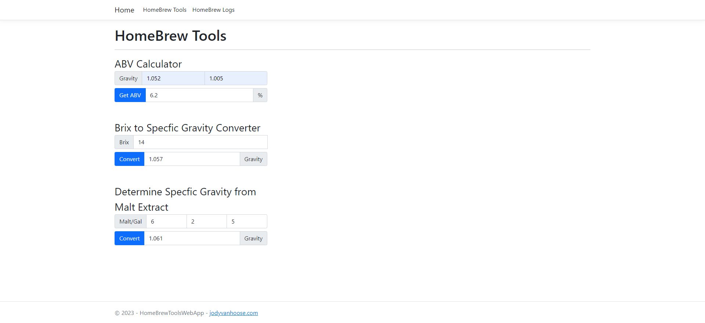

  # HomeBrew Tools Web App
  ## Developer: Jody VanHoose
  ### Check out my <a href="https://www.linkedin.com/in/jody-vanhoose/" target="_blank">LinkedIn</a>
  ### Portfolio website: <a href="https://www.jodyvanhoose.com" target="_blank">www.jodyvanhoose.com</a>

  ___
  ## About
  ### Home brew tools & home brew logs
  The homebrew tool is a C# razor pages application that creates logs for beer and mead to monitor and update specfic gravity. It also can calculate ABV(alcohol by volume), convert Brix to Specfic Gravity, and determine Specfic Gravity from amount and type of malt extract. This app was developed for the software development II track of the boot camp <a href="http://codekentucky.org/" target="_blank">Code Kentucky</a> in which I am enrolled.

  ### Screenshots

  
  
  

  ### Instructions
  * Clone Repository: Using the green 'Code' button above clone the repo to your local machine
  * Open the file HomeBrewToolsWebApp.sln in Visual Studio (or your preferred IDE)
  * Press F5 or Run Debug to begin application
  * Web page will open up
  * Example recordings for logging home brew recordings for non homebrewers needing to test:

    * Name: Anything
    * Type: IPA 
    * Start Date: 6/25/23
    * Starting Gravity: 1.065
    * Updated Gravity: 1.015
    * Final Gravity: 1.010
    * Updated Date: 7/29/23
    ---

    * Name: Anything
    * Type: Mead
    * Start Date: 6/28/23
    * Starting Gravity: 1.115
    * Updated Gravity: 1.020
    * Final Gravity:
    * Updated Date: 7/20/23
    ---

    * Name: Anything
    * Type: Brown Ale
    * Start Date: 7/25/23
    * Starting Gravity: 1.050
    * Updated Gravity:
    * Final Gravity:
    * Updated Date:
---

  * Example OG and FG for Home brew tools ABV Calculator for non homebrewers needing to test:
  
    * OG: 1.052
    * FG: 1.008
    ---
    * OG: 1.065
    * FG: 1.010
    ---
    * OG: 1.115
    * FG: 1.012
  ---
  * Example Brix recording for Home brew tools Brix to Specfic Gravity Converter for non homebrewers needing to test:

    * Brix: 14
    * Brix: 12
    * Brix: 26

  ___
  ### Key Features
  * Easy to navigate UI
  * Home Brew Log:
      * Using SQL lite to create a home brew log to monitor specfic gravity for:
        * Beer
        * Mead
  * Home brew tools:
      * ABV calculator using Brix or Specfic Gravity
      * Brix to Specfic Gravity converter
      * Specfic Gravity by malt extract calculator
  ___
  ### Technologies/Languages/Libraries
  * C#
  * .NET
  * Razor pages 
  * Fluent Validation
  * Entity Framework
  * SQL Lite
  ___

  ### Required Features (3 or more features)
  * Implement a regular expression (regex) to ensure a field either is always stored and displayed in the same format
  * Add comments to your code explaining how you are using at least 2 of the solid principles
  * Make your application asynchronous
  * Use Fluent validation to validate input fields to ensure appropriate outcome(approved by Code Ky Mentors)
  * Create 3 or more unit tests for your application

